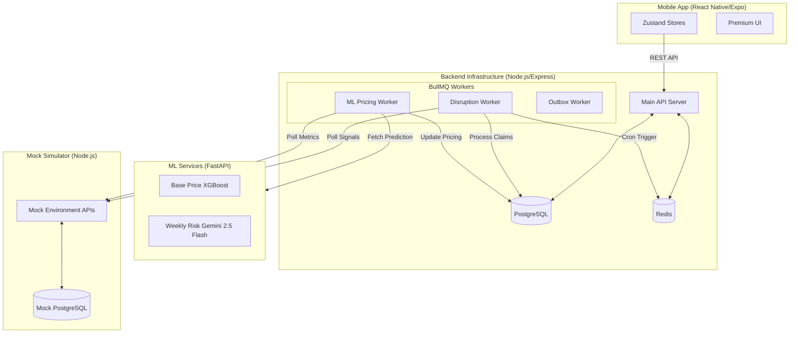

# EarnGuard
### AI-Powered Parametric Income Protection for India's Delivery Partners

> [!TIP]
> **Technical Documentation Shortcuts:**
> - **[Core Backend Architecture](docs/core_architecture.md)**: Deep-dive into the Node.js/Express backend, BullMQ/Redis worker lifecycle (like the 15-min disruption detection), and mock server integrations.
> - **[ML Pricing Architecture](docs/ml_architecture.md)**: Analysis of the XGBoost base pricing and Risk assessment models.
> - **[Mobile App Architecture](docs/mobile_architecture.md)**: Breakdown of the React Native client, Zustand state management, and API security model.

---

## Table of Contents

1. [Problem Statement](#1-problem-statement)  
2. [Persona-Based Scenarios & Workflow](#2-persona-based-scenarios--workflow)  
   - [2.1 Supported Persona](#21-supported-persona)  
   - [2.2 Scenario Walkthroughs](#22-scenario-walkthroughs)  
   - [2.3 End-to-End Application Workflow](#23-end-to-end-application-workflow)  

3. [Weekly Premium Model & Parametric Triggers](#3-weekly-premium-model--parametric-triggers)  
   - [3.1 Why Weekly Pricing?](#31-why-weekly-pricing)  
   - [3.2 Premium Formula](#32-premium-formula)  
   - [3.3 Payout Formula](#33-payout-formula)  
   - [3.4 Parametric Triggers](#34-parametric-triggers)  

4. [Platform Choice](#4-platform-choice)  

5. [AI / ML Integration Plan](#5-ai--ml-integration-plan)  
   - [5.1 ML Components Overview](#51-ml-components-overview)  
   - [5.2 Premium Calculation — ML Workflow](#52-premium-calculation--ml-workflow)  
   - [5.3 Fraud Detection — Three-Layer Approach](#53-fraud-detection--three-layer-approach)  
   - [5.4 AI in the Admin Portal](#54-ai-in-the-admin-portal)  

6. [Tech Stack](#6-tech-stack)  
7. [System Architecture](#7-system-architecture)  
8. [Coverage Constraints & Golden Rules](#8-coverage-constraints--golden-rules)  
9. [Key Differentiators](#9-key-differentiators)
10. [Adversarial Defense & Anti-Spoofing Strategy](#10-adversarial-defense--anti-spoofing-strategy)

---

## 1. Problem Statement

India has over **2 million quick-commerce delivery partners** working for platforms like Zepto and Blinkit. These workers operate on ultra-fast delivery windows — 10 to 30 minutes per order — making them uniquely vulnerable when external disruptions halt their ability to work. A single disrupted interval can wipe out several hours of income with no recourse.

External disruptions such as extreme weather (floods, heavy rain, heat), social events (curfews, strikes, zone closures), and platform outages force workers off the road for hours at a time — directly wiping out the income they would have earned during those hours. There is currently no safety net for these losses.

> **EarnGuard solves this with a parametric, AI-driven weekly insurance product that:**
> - Pays out **automatically** when a disruption is detected — no claim filing required
> - Prices risk **dynamically each week** using real data — weather, platform signals, news
> - Detects fraud **intelligently** using ML-based anomaly detection
> - Operates within a strict **income-loss-only** coverage scope

---

## 2. Persona-Based Scenarios & Workflow

### 2.1 Supported Persona

EarnGuard exclusively serves **quick-commerce (Q-commerce) delivery partners** — workers who deliver groceries and essentials within 10–30 minute windows. This focused scope is what makes zone-wise disruption mapping accurate and operationally meaningful.

| Persona | Platforms | Key Disruption Types | Typical Weekly Income |
|---|---|---|---|
| Q-commerce delivery partner | Zepto, Blinkit | Heavy rain, floods, extreme heat, area closures, platform outages, curfews | Rs. 4,500 – Rs. 8,000 |

> **Why only Q-commerce?** Q-commerce workers operate out of fixed dark stores mapped to specific micro-zones. This makes zone-wise risk mapping precise — we know exactly which dark store a worker is assigned to, which zone they cover, and what disruption events affect that zone. Extending to food delivery or e-commerce would require fundamentally different zone models and is out of scope for this iteration.

---

### 2.2 Scenario Walkthroughs

#### Scenario A — Ravi, Zepto delivery partner, Hyderabad *(parametric auto-trigger — weather)*

Ravi is a Zepto dark store partner in Kondapur, Hyderabad (weekly premium: Rs. 350, multiplier k = 0.6). On Sunday afternoon, Hyderabad receives an IMD red alert for heavy rainfall. The disruption detection pipeline identifies his dark store zone (Kondapur) as high-risk (risk score: 0.78) and fires a parametric trigger — **no action needed from Ravi**. The disrupted interval is Sunday 2 pm – 8 pm (6 hours). At his zone's median income rate of Rs. 110/hr:
- Interval loss = Rs. 660
- Base coverage = 0.6 × Rs. 350 = **Rs. 210**
- Remaining loss = Rs. 450
- Risk-adjusted amount = Rs. 450 × 0.78 = **Rs. 351**
- **Total payout = Rs. 561 for that interval**

Credited to his EarnGuard wallet by Monday morning. He withdraws it via UPI.

#### Scenario B — Priya, Blinkit delivery partner, Delhi *(news NLP trigger — social disruption)*

Priya is assigned to a Blinkit dark store in South Delhi (weekly premium: Rs. 300, multiplier k = 0.6). A local strike affecting her zone is picked up by the news NLP model on Wednesday morning and classified as a social disruption event. Her zone score crosses the threshold — claim auto-initiated. The fraud module confirms she was active in her dark store zone before the disruption and finds no duplicate claim. The disrupted interval is Wednesday 8 am – 2 pm (6 hours). At her zone's median income rate of Rs. 95/hr:
- Interval loss = Rs. 570
- Base coverage = 0.6 × Rs. 300 = **Rs. 180**
- Remaining loss = Rs. 390
- Risk-adjusted amount = Rs. 390 × 0.84 = **Rs. 328**
- **Total payout = Rs. 508 for that interval**

Scheduled for payment that evening.

#### Scenario C — Karthik, Zepto delivery partner, Bangalore *(fraud attempt blocked)*

Karthik is assigned to a Zepto dark store in Koramangala. He files a manual claim citing a platform outage during Friday evening. The system checks Zepto's platform API logs — no outage is recorded for his zone during that interval. His GPS activity log also shows he was active and completing orders during the claimed period. The multiagent validation flags the claim as invalid across all three checks (platform, weather, location). The claim is **rejected**, Karthik is notified, and the anomaly is logged for future model training.

---

### 2.3 End-to-End Application Workflow

```
Worker opens EarnGuard app
        │
        ▼
1. ONBOARDING
   ├── Select platform (Zepto / Blinkit)
   ├── KYC verification — Aadhaar / PAN (mock for demo)
   ├── Link platform account → dark store zone auto-assigned
   └── Confirm coverage start date
        │
        ▼
2. RISK ASSESSMENT  (runs every Sunday for the coming week)
   ├── Ingest — Weather API, Platform API, News API, Driver activity
   ├── ML pipeline computes zone risk score
   ├── Premium ML model outputs weekly premium in Rs.
   └── Worker sees premium → confirms coverage
        │
        ▼
3. REAL-TIME MONITORING  (continuous, per interval)
   ├── Zone-wise disruption detection pipeline scans all signals
   ├── Disruption risk % computed for each zone
   ├── If risk % > threshold → parametric trigger fires
   └── Auto-claim initiated (zero worker action)
        │
        ▼
4. CLAIM PROCESSING & FRAUD DETECTION
   ├── Duplicate claim check
   ├── Multiagent validation (Platform API + Weather API + logs)
   ├── ML anomaly detector scores the claim
   ├── Valid → payout scheduled
   └── Invalid → rejected, worker notified
        │
        ▼
5. PAYOUT
   ├── Interval loss calculated: zone median income rate × disruption hours × risk %
   ├── Each qualifying interval generates its own payout amount
   ├── Payouts accumulated in EarnGuard in-app wallet
   ├── Worker withdraws on-demand
   └── Processed via Stripe sandbox / UPI mock
```

---

## 3. Weekly Premium Model & Parametric Triggers

### 3.1 Why Weekly Pricing?

Gig workers are paid **weekly** by their platforms. Monthly or annual insurance premiums are structurally misaligned with this earning cadence. Weekly pricing means:

- The premium reflects **current week's risk**, not a stale annual average
- Workers can **opt in or out each week** based on their schedule
- Premium and income operate on the **same cycle** — a disrupted week is covered by that week's premium

---

### 3.2 Premium Formula

```
Total Weekly Premium  =  City-Tier Base Price  +  Weekly Risk Additional Amount

Where:
  City-Tier Base Price   =  f(weather, demand, income context) (Predicted via XGBoost ML Model)
  Weekly Risk Amount     =  weather risk contribution + news/social risk + platform outage risk (Generated via Gemini LLM & Pricing Engine)
```

The **City-Tier Base Price** is predicted using an XGBoost model that reflects structural and historical risk features. The **Weekly Risk Additional Amount** reacts dynamically to specific signals observed for the upcoming week, calculated using Gemini-based NLP risk assessment and a deterministic pricing engine.

> **Architectural Note:** To prevent fragmenting market features, the ML Pricing engines (XGBoost/Gemini) calculate and assign premiums universally across the **City** level. However, actual structural Disruption Tracking and Claim Payouts are bound strictly to granular **Zones** (Dark Store geo-fences).

---

### 3.3 Payout Formula

EarnGuard covers the income lost during a specific disruption interval using a **two-component payout model**. Each disruption event produces its own independent payout calculation.

> **Key intuition:**
> - The **base coverage** ensures workers are never left with zero payout when a disruption is confirmed
> - The **risk-adjusted component** ensures higher disruption severity → higher compensation

```
Payout For a Disruption Interval  =  Base Coverage Amount  +  Risk-Adjusted Amount

Where:
  Interval Loss          =  Zone median income rate (Rs./hr)  ×  Duration of disruption (hrs)

  Base Coverage Amount   =  k  ×  Interval Loss
                            (k is a fixed coverage multiplier, e.g. 0.2 – 0.6)

  Remaining Loss         =  max(0,  Interval Loss  −  Base Coverage Amount)

  Risk-Adjusted Amount   =  Remaining Loss  ×  Disruption Risk %
```

**Worked example:**

```
Zone median income rate  =  Rs. 110 / hr
Disruption duration      =  6 hours
Weekly premium           =  Rs. 350
Coverage multiplier (k)  =  0.2
Disruption risk score    =  0.78

Interval Loss            =  110  ×  6             =  Rs. 660
Base Coverage Amount     =  0.2  ×  660            =  Rs. 132
Remaining Loss           =  max(0, 660 − 132)      =  Rs. 528
Risk-Adjusted Amount     =  528  ×  0.78           =  Rs. 411.84

→ Total Payout           =  132  +  411.84            =  Rs. 543.84 for that interval
```

A worker may receive **multiple interval payouts in a single week** if multiple qualifying disruption events occur. The weekly premium and multiplier `k` are fixed at the start of the coverage week; each qualifying disruption interval within that window triggers its own independent payout calculation.

---

### 3.4 Parametric Triggers

A parametric trigger is an **objective, externally verifiable event** that automatically initiates a claim — no paperwork, no proof required from the worker.

| Trigger Type | Signal Source | Example Condition | Auto-Payout? |
|---|---|---|---|
| Environmental | Weather API (IMD / OpenWeatherMap) | Heavy rain > 50mm/hr for 3+ hrs in zone | Yes |
| Social disruption | News NLP model (headlines, social signals) | Strike or curfew detected in delivery zone | Yes |
| Platform outage | Platform API (order drop rate, app status) | Order volume drops >60% in zone for 2 hrs | Yes |
| Manual claim | Worker submission via app | Worker reports income loss manually | After validation |

> All parametric triggers are subject to a **risk threshold check**. A disruption risk score below the configured threshold is stored for monitoring but does not trigger a payout — ensuring the system only pays out on material disruption events that genuinely halted worker activity. When triggered, the payout covers the income lost during that specific interval only.

---

## 4. Platform Choice

### Mobile App (Android/iOS) for Workers + Web Portal for Admins

We chose a **native mobile app for workers** and a **web portal for the admin/insurer dashboard** for the following reasons:

#### Worker App — Why Mobile?

| Consideration | Justification |
|---|---|
| How delivery partners work | Q-commerce workers are on the road on their phone all day, operating out of fixed dark stores. A mobile app fits naturally into this workflow. |
| Push notifications | Native push notifications for disruption alerts and payout confirmations work reliably on mobile — critical for a real-time product. |
| UPI / payment integration | Mobile-native UPI integration (via Stripe / Razorpay SDK) is smoother than web-based payment on a phone browser. |
| Offline capability | Workers in low-connectivity zones can still view their policy status and wallet balance via cached data. |
| Trust & familiarity | Delivery partners already use dedicated apps for their work. A standalone EarnGuard app builds brand trust and habit. |

#### Admin / Insurer Portal — Why Web?

| Consideration | Justification |
|---|---|
| Dashboard complexity | Heatmaps, trend graphs, claim tables, fraud monitoring — this is desktop-heavy work, not suited to a small screen. |
| Multi-user access | Insurance ops teams work on laptops/desktops. A web portal allows multiple team members to access it simultaneously. |
| Data density | Admins need to view zone-level data, ML metrics, and approval queues side by side. Web gives the screen real estate for this. |
| No install friction | Internal teams can access the portal via URL — no app deployment needed for the ops team. |

---

## 5. AI / ML Integration Plan

AI and ML are not bolt-ons in EarnGuard — they are the **core engine** of the product. Every pricing decision, every trigger, and every fraud check is data-driven.

### 5.1 ML Components Overview

| Component | Model Type | Inputs | Output | Status |
|---|---|---|---|---|
| City Base Price Model | Gradient-boosted regression (XGBoost) | Historical weather, demand, and income context data | City-tier base price (Rs.) | Implemented |
| Weekly Risk Assessor | Large Language Model (Gemini 2.5 Flash) | Real-time weather, platform status, local news snippets | Disruption type, severity score (0-1) | Implemented |
| Weekly Pricing Engine | Deterministic Algorithm | Base price, generated risk scores, configuration | Weekly Risk Additional Amount (Rs.) | Implemented |
| Fraud / anomaly detector | Isolation Forest + rule-based layer | Claim history, location data, platform order logs, weather match | Fraud score 0–1 + accept/reject | Planned |
| Model health monitor | Statistical drift detection | Live prediction distributions vs. training baseline | Drift alert + retrain trigger | Planned |

---

### 5.2 Premium Calculation — ML Workflow

1. Historical data is processed and a base price is computed using the **XGBoost City Base Price Model**.
2. Raw real-time data is collected (Weather, News, Platform Signals) for the coming week.
3. The **Gemini Risk Assessor LLM** processes these signals and classifies disruptions, generating a structured risk assessment with quantitative scores (0 to 1).
4. The **Weekly Pricing Engine** combines the risk score with base pricing rules to compute the final Weekly Risk Additional Amount.
5. The **Total Weekly Premium** is the sum of the predicted base price and the risk additional amount.

---

### 5.3 Fraud Detection — Three-Layer Approach

All claims (auto-triggered and manual) pass through three layers:

**Layer 1 — Duplicate check**
Has this exact claim (same worker, same zone, same event window) been processed before? If yes → reject immediately.

**Layer 2 — Multiagent validation**
Three independent validation agents check the claim against:
- **Platform API** — was the worker active in the zone during the claimed interval?
- **Weather API** — was the weather condition actually severe at that location/time?
- **System logs** — was the disruption event independently recorded by the pipeline?

A rule-based validation score is computed from these three checks.

**Layer 3 — ML anomaly detection**
An Isolation Forest model trained on historical valid and fraudulent claims scores the new claim. If the anomaly score exceeds the threshold, the claim is flagged for rejection or manual review.

Claims passing all three layers are approved. The full validation trace is stored for audit and future model retraining.

---

### 5.4 AI in the Admin Portal

The admin web portal exposes ML outputs to the insurer team:

- **Zone risk heatmap** — real-time map of risk scores per zone (powered by the disruption scorer)
- **Model health dashboard** — monitors risk score accuracy, fraud model F1 score, and data drift
- **Fraud analytics** — anomaly score distributions, flagged claim patterns, duplicate rates
- **Premium vs payout trends** — weekly loss ratio, city-level performance

---

## 6. Tech Stack

| Layer | Technology | Purpose |
|---|---|---|
| Mobile app (worker) | React Native (Android + iOS) | EarnGuard worker app |
| Admin web portal | React + Vite, TailwindCSS | Insurer / ops dashboard |
| Backend API | Node.js / Express | Business logic, orchestration, REST API |
| ML services | Python (FastAPI), scikit-learn, XGBoost, Google Gemini 2.5 Flash API | Base price prediction, NLP risk assessment, API routing |
| Database | PostgreSQL (structured data), Redis (caching / queues) | Worker profiles, claims, premiums, zone events |
| External APIs | OpenWeatherMap / IMD (mock), NewsAPI (mock), Platform API (mock) | Weather, news, platform signal ingestion |
| Payment | Stripe sandbox / Razorpay mock | Payout processing, UPI integration |
| Notifications | Firebase Cloud Messaging (FCM) | Push notifications on mobile for disruption alerts and payout confirmations |
| Deployment | Expo (mobile build), Vercel (admin portal), Railway (backend + ML) | Fully hosted demo environment |
| Version control | GitHub (monorepo) | Source code + documentation |

---

## 7. System Architecture

EarnGuard is a distributed ecosystem consisting of four main services that work together to provide autonomous, data-driven insurance.

### 7.1 High-Level Component Diagram



### 7.2 Detailed Documentation

For a deeper dive into the internal workings of each component, please refer to the following documentation:

- 🏗️ **[Core Backend Architecture](docs/core_architecture.md)** — BullMQ workers, Redis connection, and disruption detection logic.
- 🧠 **[ML Pricing Architecture](docs/ml_architecture.md)** — Detailed look at the XGBoost and Gemini 2.5 Flash models.
- 📱 **[Mobile App Architecture](docs/mobile_architecture.md)** — Zustand state management and React Native structure.

---

## 8. Coverage Constraints & Golden Rules

> ⚠️ These constraints are hard-coded into EarnGuard's product logic and cannot be overridden.

1. **Coverage scope — INCOME LOSS ONLY.** No payouts for vehicle repairs, health incidents, accidents, or life events.
2. **Weekly premium, interval payouts.** The premium is structured on a weekly basis. Payouts are calculated per disruption interval within the covered week — not as a weekly lump sum.
3. **Q-commerce only.** EarnGuard exclusively serves Zepto and Blinkit delivery partners. Food delivery, e-commerce, and ride-share workers are out of scope — zone-wise disruption mapping is built around Q-commerce dark store zones.
4. **Disruption triggers — external and verifiable only.** No subjective self-reported losses without independent validation from at least two data sources.

---

## 9. Key Differentiators

- **Zero-touch claims** — parametric triggers mean workers never need to file a claim for covered events
- **Hyper-local risk pricing** — premium recalculated weekly per zone, not per city or annually
- **Three-layer fraud detection** — duplicate check + multiagent validation + ML anomaly scoring
- **Mobile-first for workers** — React Native app with UPI integration and offline support, designed for on-the-road use
- **Income-cycle aligned** — weekly premium matches gig worker earning and spending patterns exactly
- **Interval-accurate payouts** — workers are compensated for the exact hours lost during a disruption, not a rough weekly percentage

---

## 10. Adversarial Defense & Anti-Spoofing Strategy

> 🚨 **Threat Scenario:** A coordinated ring of 500+ delivery workers uses GPS-spoofing applications to fake their location inside a severe weather zone while they are safely at home — triggering mass parametric payouts and draining the liquidity pool.

EarnGuard's existing three-layer fraud detection catches individual anomalies. This section documents the **fourth defensive layer** — a dedicated anti-spoofing module designed specifically to defeat coordinated, GPS-based fraud rings.

---

### 9.1 The Differentiation — Genuine Stranding vs. GPS Spoofing

The fundamental insight is that **a spoofed GPS signal is just one data point**. A genuinely stranded delivery partner produces a rich, correlated behavioral fingerprint that a bad actor at home cannot fully replicate. EarnGuard's anti-spoofing layer cross-validates GPS against a portfolio of independent, realistic signals to detect this mismatch.

| Signal Layer | Genuine Stranded Worker | GPS Spoofer at Home |
|---|---|---|
| **Platform order activity** | Order acceptance drops to zero — platform confirms no orders dispatched to zone | May still show order activity, or drops suspiciously in sync with all ring members |
| **Dark store check-in status** | Platform API confirms worker checked in before disruption started | No active check-in record for that shift |
| **Last active delivery timestamp** | Completed a delivery immediately before disruption — confirms zone presence | Last delivery hours earlier — zone presence unverified |
| **Accelerometer / motion** | Stationary shelter pattern, short movement bursts consistent with outdoor waiting | Calm indoor pattern inconsistent with being stranded in a storm |
| **Claim timing & history** | Normal claim frequency; history consistent with zone and schedule | Claim filed in tight cluster with ring members; sudden frequency spike |
| **Device ID / UPI handle** | Unique device + payout account | May share device ID or UPI handle with other ring members |

The anti-spoofing module computes a **Location Authenticity Score (LAS)** from 0 to 1 by fusing all of the above signals. A GPS coordinate alone contributes only a partial weight to this score.

---

### 9.2 The Data — Specific Signals Beyond Basic GPS

**Platform-side signals (via Platform API — gold standard):**
- **Order dispatch log** — the platform API records whether orders were dispatched to the worker's zone during the claimed interval. A real disruption drives zone order volume to near-zero. If orders were being dispatched and accepted by others in the same zone while the worker claims disruption, the claim is weakened.
- **Dark store check-in / check-out timestamps** — platforms log when workers check in and out of their assigned dark store. A valid disruption claim must show the worker was checked in before the disruption started.
- **Last-confirmed active delivery timestamp** — if the worker completed a delivery seconds before the disruption, physical zone presence is confirmed. If the last delivery was hours prior, presence is unverified.

**Device-level signals (from EarnGuard mobile app):**
- **Accelerometer / motion patterns** — delivery partners sheltering during a storm show distinct motion signatures: stationary periods, short bursts, vibration consistent with an outdoor environment. A person sitting comfortably at home produces a markedly different, calmer indoor motion profile. This signal is used as a supporting indicator, not a sole determinant.

**Behavioral and historical signals (ML-derived):**
- **Claim timing clustering** — if a worker's claim is filed within a tight time window shared by many other workers from the same zone, this is a coordinated fraud indicator. Genuine disruptions produce a spread of claim times; rings file in bursts.
- **Claim frequency spike** — a sudden jump in claim frequency for a worker with no prior claims, or a worker whose frequency is far above their historical baseline, is flagged for elevated scrutiny.
- **Historical consistency** — the Isolation Forest model (Layer 3) is trained on each worker's own history. A claim pattern that is anomalous relative to that worker's personal baseline scores higher for fraud risk.

**Population-level signals (ring detection):**
- **Simultaneous claim spike detection** — the system monitors new claims per zone per 10-minute window. If the arrival rate exceeds 3× the historical baseline for that zone, a ring alert fires to the admin portal.
- **Co-claim graph clustering** — a graph is built where each node is a worker and edges connect workers who filed claims in the same zone within the same 30-minute window, across all historical events. Tightly connected communities (detected using the Louvain method) with elevated anomaly scores are flagged as probable rings. This runs as a batch job every 15 minutes during active disruption events.
- **Device ID / UPI account overlap** — multiple claims linked to the same device ID or UPI payout handle are flagged as duplicate ring accounts immediately.

---

### 9.3 The UX Balance — Protecting Honest Workers

The most dangerous failure in fraud detection is over-triggering false positives — penalising a genuine worker at the worst moment of their week. EarnGuard's flagging workflow is deliberately tiered to avoid this.

#### Flagging Tiers

```
LAS Score         │ System Action
──────────────────┼─────────────────────────────────────────────────────────
0.85 – 1.00       │ AUTO-APPROVED  — Payout proceeds normally
0.60 – 0.84       │ SOFT-FLAG      — Payout proceeds; claim tagged for 
                  │    asynchronous review within 24 hrs. Worker not notified.
0.35 – 0.59       │ HOLD & VERIFY  — Payout paused. Worker sent a 
                  │    one-tap verification request (see below).
0.00 – 0.34       │ HARD-REJECT    — Claim denied. Worker notified with 
                  │    a plain-language explanation and the option to appeal.
```

#### The One-Tap Verification Request (for HOLD & VERIFY tier)

When a claim is held, EarnGuard sends the worker a single push notification:

> *"We noticed something unusual during your coverage interval. To confirm your payout of Rs. X, please tap below and share your approximate location for 30 seconds."*

This does **not** ask the worker to call anyone, upload documents, or navigate a claims portal. It requests a brief live check that cross-validates against platform check-in data and motion patterns. The result is processed immediately and the payout is either released or escalated to human review.

Workers have **4 hours** to respond before the claim times out — fully accounting for a genuine worker sheltering with degraded connectivity during the disruption.

#### Network Drop Handling

Bad weather inherently degrades mobile connectivity. EarnGuard handles this explicitly:

- If the worker was confirmed in the disrupted zone before the network drop (via dark store check-in and last delivery timestamp), that pre-drop evidence is carried forward to support the claim.
- A connectivity gap during a confirmed disruption interval does **not** itself trigger a flag — it is expected behavior. Only a connectivity gap combined with other anomalies (unusual motion pattern, platform order activity continuing, no check-in record) raises the flag.
- Workers who time out on the verification request due to genuine network issues are automatically escalated to a **human review queue** — not auto-rejected. A human reviewer in the admin portal examines the full evidence trace and can approve the claim manually within 24 hours.

#### Appeals

Any rejected claim can be appealed via a simple in-app flow. The worker submits one piece of supporting evidence (a photo, platform app screenshot, or brief text explanation). Appeals are reviewed by the ops team within 48 hours and approved claims are paid out with no penalty to the worker's account history.

---

### 9.4 Ring Detection — Coordinated Fraud at Scale

Individual worker-level detection catches isolated spoofers. Defeating a coordinated ring of 500 requires a population-level view.

**The Ring Detection Pipeline (runs every 15 minutes during active disruption events):**

1. **Claim burst monitor** — if claim arrivals from a single zone exceed 3× the historical baseline within a 10-minute window, an alert is raised to the admin portal automatically.

2. **Co-claim graph analysis** — communities of workers who consistently file together, identified via Louvain clustering on the co-claim graph, are flagged as probable rings when their aggregate anomaly score is above threshold.

3. **Mass hold trigger** — when a probable ring is detected, all pending claims from that cluster move to HOLD simultaneously. Workers who pass the one-tap verification are released to payout; others are escalated to manual review.

4. **Ring evidence package** — the admin portal auto-generates an evidence report for the flagged cluster: member list, claim timestamps, LAS scores, co-claim graph visualisation, and device/UPI overlap. Designed for internal remediation and, if needed, handoff to the platform partner.

5. **Model feedback loop** — confirmed ring fraud events are fed back into the Isolation Forest retraining pipeline, continuously sharpening anomaly detection against evolving tactics.

---

### 9.5 Architectural Summary

```
Claim arrives (auto-trigger or manual)
        │
        ▼
[Existing Layer 1]  Duplicate check
        │
        ▼
[Existing Layer 2]  Multiagent validation (Platform API + Weather API + logs)
        │
        ▼
[Existing Layer 3]  Isolation Forest anomaly score
        │
        ▼
[NEW Layer 4]  Anti-Spoofing Module
   ├── Platform signals: order dispatch log, dark store check-in,
   │   last active delivery timestamp
   ├── Device signals: accelerometer / motion pattern (supporting indicator)
   ├── Behavioral signals: claim timing cluster, frequency spike,
   │   historical consistency
   ├── Population signals: claim burst monitor, co-claim graph
   │   clustering (Louvain), device ID / UPI overlap
   └── → Compute Location Authenticity Score (LAS)
        │
        ┌────────────────────────────────────┐
        │  LAS ≥ 0.85  → Auto-approve        │
        │  LAS 0.60–0.84 → Soft-flag, pay    │
        │  LAS 0.35–0.59 → Hold + verify     │
        │  LAS < 0.35  → Reject + appeal     │
        └────────────────────────────────────┘
```

> **Design principle:** The anti-spoofing layer is additive — it does not replace or short-circuit the three existing fraud layers. Every claim still passes all four layers. The LAS score is one input to the final decision, not the sole determinant. This prevents the new layer from becoming a single point of failure or over-penalising genuine workers.

---

*EarnGuard — Guidewire DEVTrails 2026 — Phase 1 Submission*  
*Coverage: Income loss only | Pricing: Weekly | Persona: Q-commerce delivery partners (Zepto, Blinkit)*  
*Anti-spoofing layer added: March 2026 — in response to coordinated GPS fraud threat*
