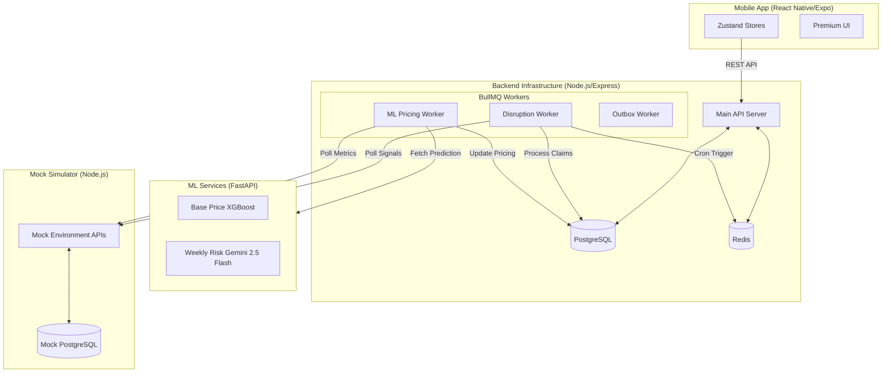

# EarnGuard
### AI-Powered Parametric Income Protection for India's Delivery Partners

> [!TIP]
> **Technical Documentation Shortcuts:**
> - **[Core Backend Architecture](docs/core_architecture.md)**: Deep-dive into the Node.js/Express backend, BullMQ/Redis worker lifecycle (like the hourly disruption detection), and mock server integrations.
> - **[ML Pricing Architecture](docs/ml_architecture.md)**: Analysis of the XGBoost base pricing and Risk assessment models.
> - **[Mobile App Architecture](docs/mobile_architecture.md)**: Breakdown of the React Native client, Zustand state management, and API security model.

---

## Table of Contents

1. [Problem Statement](#1-problem-statement)  
2. [Persona-Based Scenarios & Workflow](#2-persona-based-scenarios--workflow)  
   - [2.1 Supported Persona](#21-supported-persona)  
   - [2.2 Scenario Walkthroughs](#22-scenario-walkthroughs)  
   - [2.3 End-to-End Application Workflow](#23-end-to-end-application-workflow)  

3. [Weekly Premium Model & Parametric Triggers](#3-weekly-premium-model--parametric-triggers)  
   - [3.1 Why Weekly Pricing?](#31-why-weekly-pricing)  
   - [3.2 Premium Formula](#32-premium-formula)  
   - [3.3 Payout Formula](#33-payout-formula)  
   - [3.4 Parametric Triggers](#34-parametric-triggers)  

4. [Platform Choice](#4-platform-choice)  

5. [AI / ML Integration Plan](#5-ai--ml-integration-plan)  
   - [5.1 ML Components Overview](#51-ml-components-overview)  
   - [5.2 Premium Calculation — ML Workflow](#52-premium-calculation--ml-workflow)  
   - [5.3 Fraud Detection — Three-Layer Approach](#53-fraud-detection--three-layer-approach)  
   - [5.4 AI in the Admin Portal](#54-ai-in-the-admin-portal)  

6. [Tech Stack](#6-tech-stack)  
7. [System Architecture](#7-system-architecture)  
8. [Coverage Constraints & Golden Rules](#8-coverage-constraints--golden-rules)  
9. [Key Differentiators](#9-key-differentiators)
10. [Adversarial Defense & Anti-Spoofing Strategy](#10-adversarial-defense--anti-spoofing-strategy)
11. [Disruption Engine Refactor & Intelligence Upgrade](#11-disruption-engine-refactor--intelligence-upgrade)

---

## 1. Problem Statement

India has over **2 million quick-commerce delivery partners** working for platforms like Zepto and Blinkit. These workers operate on ultra-fast delivery windows — 10 to 30 minutes per order — making them uniquely vulnerable when external disruptions halt their ability to work. A single disrupted interval can wipe out several hours of income with no recourse.

External disruptions such as extreme weather (floods, heavy rain, heat), social events (curfews, strikes, zone closures), and platform outages force workers off the road for hours at a time — directly wiping out the income they would have earned during those hours. There is currently no safety net for these losses.

> **EarnGuard solves this with a parametric, AI-driven weekly insurance product that:**
> - Pays out **automatically** when a disruption is detected — no claim filing required
> - Prices risk **dynamically each week** using real data — weather, platform signals, news
> - Detects fraud **intelligently** using ML-based anomaly detection
> - Operates within a strict **income-loss-only** coverage scope

---

## 2. Persona-Based Scenarios & Workflow

### 2.1 Supported Persona

EarnGuard exclusively serves **quick-commerce (Q-commerce) delivery partners** — workers who deliver groceries and essentials within 10–30 minute windows. This focused scope is what makes zone-wise disruption mapping accurate and operationally meaningful.

| Persona | Platforms | Key Disruption Types | Typical Weekly Income |
|---|---|---|---|
| Q-commerce delivery partner | Zepto, Blinkit | Heavy rain, floods, extreme heat, area closures, platform outages, curfews | Rs. 4,500 – Rs. 8,000 |

> **Why only Q-commerce?** Q-commerce workers operate out of fixed dark stores mapped to specific micro-zones. This makes zone-wise risk mapping precise — we know exactly which dark store a worker is assigned to, which zone they cover, and what disruption events affect that zone. Extending to food delivery or e-commerce would require fundamentally different zone models and is out of scope for this iteration.

---

### 2.2 Scenario Walkthroughs

#### Scenario A — Ravi, Zepto delivery partner, Hyderabad *(parametric auto-trigger — weather)*

Ravi is a Zepto dark store partner in Kondapur, Hyderabad (weekly premium: Rs. 350, multiplier k = 0.6). On Sunday afternoon, Hyderabad receives an IMD red alert for heavy rainfall. The disruption detection pipeline identifies his dark store zone (Kondapur) as high-risk (risk score: 0.78) and fires a parametric trigger. The disrupted interval is Sunday 2 pm – 3 pm (1 hour in demo mode, or 6 hours in production). At his individualized income rate of Rs. 120/hr:
- Interval loss = Rs. 120 (for 1 hour)
- Base coverage = 0.6 × Rs. 120 = **Rs. 72** (k × Interval Loss)
- Remaining loss = max(0, 120 - 72) = Rs. 48
- Risk-adjusted amount = Rs. 48 × 0.78 = **Rs. 37.44**
- **Total payout = Rs. 109.44 for that interval**

Credited to his EarnGuard wallet automatically. He withdraws it via UPI.

Credited to his EarnGuard wallet by Monday morning. He withdraws it via UPI.

#### Scenario B — Priya, Blinkit delivery partner, Delhi *(news NLP trigger — social disruption)*

Priya is assigned to a Blinkit dark store in South Delhi (weekly premium: Rs. 300, multiplier k = 0.6). A local strike is picked up by the news NLP model and classified as high-risk. The fraud module confirms she was active in her zone before the disruption. The disrupted interval is Wednesday 8 am – 9 am (1 hour). At her individualized income rate of Rs. 100/hr:
- Interval loss = Rs. 100
- Base coverage = 0.6 × Rs. 100 = **Rs. 60**
- Remaining loss = Rs. 40
- Risk-adjusted amount = Rs. 40 × 0.84 = **Rs. 33.60**
- **Total payout = Rs. 93.60 for that interval**

Scheduled for payment that evening.

#### Scenario C — Karthik, Zepto delivery partner, Bangalore *(fraud attempt blocked)*

Karthik is assigned to a Zepto dark store in Koramangala. He files a manual claim citing a platform outage during Friday evening. The system checks Zepto's platform API logs — no outage is recorded for his zone during that interval. His GPS activity log also shows he was active and completing orders during the claimed period. The multiagent validation flags the claim as invalid across all three checks (platform, weather, location). The claim is **rejected**, Karthik is notified, and the anomaly is logged for future model training.

---

### 2.3 End-to-End Application Workflow

```
Worker opens EarnGuard app
        │
        ▼
1. ONBOARDING
   ├── Select platform (Zepto / Blinkit)
   ├── KYC verification — Aadhaar / PAN (mock for demo)
   ├── Link platform account → dark store zone auto-assigned
   └── Confirm coverage start date
        │
        ▼
2. RISK ASSESSMENT  (runs every Sunday for the coming week)
   ├── Ingest — Weather API, Platform API, News API, Driver activity
   ├── ML pipeline computes zone risk score
   ├── Premium ML model outputs weekly premium in Rs.
   └── Worker sees premium → confirms coverage
        │
        ▼
3. REAL-TIME MONITORING  (continuous, per interval)
   ├── Zone-wise disruption detection pipeline scans all signals
   ├── Disruption risk % computed for each zone
   ├── If risk % > threshold → parametric trigger fires
   └── Auto-claim initiated (zero worker action)
        │
        ▼
4. CLAIM PROCESSING & FRAUD DETECTION
   ├── Idempotency check (Duplicate & Client Request ID)
   ├── Parametric verification (Matching zone risk snapshots)
   ├── Location Authenticity (LAS) Scoring (Check-in + Zone Drops)
   ├── Approved → payout scheduled
   └── Flagged/Invalid → held for review or rejected
        │
        ▼
5. PAYOUT
   ├── Interval loss calculated: individualized hourly rate × duration
   ├── Payout = (k × Interval Loss) + (Remaining Loss × Risk %)
   ├── Payouts accumulated in EarnGuard in-app wallet
   ├── Worker withdraws on-demand
   └── Processed via UPI mock
```

---

## 3. Weekly Premium Model & Parametric Triggers

### 3.1 Why Weekly Pricing?

Gig workers are paid **weekly** by their platforms. Monthly or annual insurance premiums are structurally misaligned with this earning cadence. Weekly pricing means:

- The premium reflects **current week's risk**, not a stale annual average
- Workers can **opt in or out each week** based on their schedule
- Premium and income operate on the **same cycle** — a disrupted week is covered by that week's premium

---

### 3.2 Premium Formula

```
Total Weekly Premium  =  City-Tier Base Price  +  Weekly Risk Additional Amount

Where:
  City-Tier Base Price   =  f(weather, demand, income context) (Predicted via XGBoost ML Model)
  Weekly Risk Amount     =  weather risk contribution + news/social risk + platform outage risk (Generated via Gemini LLM & Pricing Engine)
```

The **City-Tier Base Price** is predicted using an XGBoost model that reflects structural and historical risk features. The **Weekly Risk Additional Amount** reacts dynamically to specific signals observed for the upcoming week, calculated using Gemini-based NLP risk assessment and a deterministic pricing engine.

> **Architectural Note:** To prevent fragmenting market features, the ML Pricing engines (XGBoost/Gemini) calculate and assign premiums universally across the **City** level. However, actual structural Disruption Tracking and Claim Payouts are bound strictly to granular **Zones** (Dark Store geo-fences).

---

### 3.3 Payout Formula

EarnGuard covers the income lost during a specific disruption interval using a **two-component payout model**. Each disruption event produces its own independent payout calculation.

> **Key intuition:**
> - The **base coverage** ensures workers are never left with zero payout when a disruption is confirmed
> - The **risk-adjusted component** ensures higher disruption severity → higher compensation

```
Payout For a Disruption Interval  =  Base Coverage Amount  +  Risk-Adjusted Amount

Where:
  Interval Loss          =  Individualized Worker Hourly Income (Rs./hr)  ×  Duration of disruption (hrs)

  Base Coverage Amount   =  k  ×  Interval Loss
                            (k is a fixed coverage multiplier, e.g. 0.2 – 0.6)

  Remaining Loss         =  max(0,  Interval Loss  −  Base Coverage Amount)

  Risk-Adjusted Amount   =  Remaining Loss  ×  Disruption Risk %
```

**Worked example:**

```
Zone median income rate  =  Rs. 110 / hr
Disruption duration      =  6 hours
Weekly premium           =  Rs. 350
Coverage multiplier (k)  =  0.2
Disruption risk score    =  0.78

Interval Loss            =  110  ×  6             =  Rs. 660
Base Coverage Amount     =  0.2  ×  660            =  Rs. 132
Remaining Loss           =  max(0, 660 − 132)      =  Rs. 528
Risk-Adjusted Amount     =  528  ×  0.78           =  Rs. 411.84

→ Total Payout           =  132  +  411.84            =  Rs. 543.84 for that interval
```

A worker may receive **multiple interval payouts in a single week** if multiple qualifying disruption events occur. In **Demo Mode**, the system is configured to trigger automated payouts every **10 minutes** to allow for immediate validation of the end-to-end flow. The weekly premium and multiplier `k` are fixed at the start of the coverage week.

---

### 3.4 Parametric Triggers

A parametric trigger is an **objective, externally verifiable event** that automatically initiates a claim — no paperwork, no proof required from the worker.

| Trigger Type | Signal Source | Example Condition | Auto-Payout? |
|---|---|---|---|
| Environmental | Weather API (IMD / OpenWeatherMap) | Heavy rain > 50mm/hr for 3+ hrs in zone | Yes |
| Social disruption | News Prolog rule engine | Strike or curfew detected in delivery zone | Pending Manual Verification if order drop is zero, else Yes |
| Platform outage | Platform API (order drop rate, app status) | Order volume drops >60% in zone for 2 hrs | Yes |
| Manual claim | Worker submission via app | Worker reports income loss manually | After validation |

> All parametric triggers are subject to a **risk threshold check**. A disruption risk score below the configured threshold is stored for monitoring but does not trigger a payout — ensuring the system only pays out on material disruption events that genuinely halted worker activity. When triggered, the payout covers the income lost during that specific interval only.

---

## 4. Platform Choice

### Mobile App (Android/iOS) for Workers + Web Portal for Admins

We chose a **native mobile app for workers** and a **web portal for the admin/insurer dashboard** for the following reasons:

#### Worker App — Why Mobile?

| Consideration | Justification |
|---|---|
| How delivery partners work | Q-commerce workers are on the road on their phone all day, operating out of fixed dark stores. A mobile app fits naturally into this workflow. |
| Push notifications | Native push notifications for disruption alerts and payout confirmations work reliably on mobile — critical for a real-time product. |
| UPI / payment integration | Mobile-native UPI integration (via Stripe / Razorpay SDK) is smoother than web-based payment on a phone browser. |
| Offline capability | Workers in low-connectivity zones can still view their policy status and wallet balance via cached data. |
| Trust & familiarity | Delivery partners already use dedicated apps for their work. A standalone EarnGuard app builds brand trust and habit. |

#### Admin / Insurer Portal — Why Web?

| Consideration | Justification |
|---|---|
| Dashboard complexity | Heatmaps, trend graphs, claim tables, fraud monitoring — this is desktop-heavy work, not suited to a small screen. |
| Multi-user access | Insurance ops teams work on laptops/desktops. A web portal allows multiple team members to access it simultaneously. |
| Data density | Admins need to view zone-level data, ML metrics, and approval queues side by side. Web gives the screen real estate for this. |
| No install friction | Internal teams can access the portal via URL — no app deployment needed for the ops team. |

---

## 5. AI / ML Integration Plan

AI and ML are not bolt-ons in EarnGuard — they are the **core engine** of the product. Every pricing decision, every trigger, and every fraud check is data-driven.

### 5.1 ML Components Overview

| Component | Model Type | Inputs | Output | Status |
|---|---|---|---|---|
| City Base Price Model | Gradient-boosted regression (XGBoost) | Historical weather, demand, and income context data | City-tier base price (Rs.) | Implemented |
| Weekly Risk Assessor | Large Language Model (Gemini 2.5 Flash) | Real-time weather, platform status, local news snippets | Disruption type, severity score (0-1) | Implemented |
| Weekly Pricing Engine | Deterministic Algorithm | Base price, generated risk scores, configuration | Weekly Risk Additional Amount (Rs.) | Implemented |
| Anti-Spoofing Scorer | Heuristic-based Scoring (LAS) | Online status, platform order drops, zone claim density | Location Authenticity Score (0-1) | Implemented |
| Model health monitor | Statistical drift detection | Live prediction distributions vs. training baseline | Drift alert + retrain trigger | Planned |

---

### 5.2 Premium Calculation — ML Workflow

1. Historical data is processed and a base price is computed using the **XGBoost City Base Price Model**.
2. Raw real-time data is collected (Weather, News, Platform Signals) for the coming week.
3. The **Gemini Risk Assessor LLM** processes these signals and classifies disruptions, generating a structured risk assessment with quantitative scores (0 to 1).
4. The **Weekly Pricing Engine** combines the risk score with base pricing rules to compute the final Weekly Risk Additional Amount.
5. The **Total Weekly Premium** is the sum of the predicted base price and the risk additional amount.

---

### 5.3 Fraud Detection — Three-Layer Approach

All claims (auto-triggered and manual) pass through three defensive layers:

**Layer 1 — Idempotency & Cooldown Protection**
The system uses a `client_request_id` to prevent duplicate submissions. It also enforces a strict cooldown period (e.g., max 5 approved claims per 24 hours) to prevent automated draining of the insurance pool.

**Layer 2 — Parametric Risk Verification**
Claims are cross-referenced against our **Disruption Engine**. A claim is only valid if independent data (Weather, News, Traffic) confirms a material disruption in the worker's specific zone during the claimed interval.

**Layer 3 — Location Authenticity (LAS) Scoring**
A heuristic scoring engine calculates a **Location Authenticity Score (0-1)** by correlating:
- **Platform Active Check-in**: Verifying if the worker was marked online by the platform dark store.
- **Zone Drop Confirmation**: Confirming that platform order volumes in that zone dropped by >30% during the disruption.
- **Ring Detection**: Flagging coordinated spikes where too many workers in the same zone file claims simultaneously.

Claims passing these layers are approved; those with low LAS scores are held for manual verification or hard-rejected.

---

### 5.4 AI in the Admin Portal

The admin web portal exposes ML outputs to the insurer team:

- **Zone risk heatmap** — real-time map of risk scores per zone (powered by the disruption scorer)
- **Model health dashboard** — monitors risk score accuracy, fraud model F1 score, and data drift
- **Fraud analytics** — anomaly score distributions, flagged claim patterns, duplicate rates
- **Premium vs payout trends** — weekly loss ratio, city-level performance

---

## 6. Tech Stack

| Layer | Technology | Purpose |
|---|---|---|
| **Mobile App** | React Native (Expo SDK 54), Zustand, Lucide Native | Multi-platform worker app with offline-first state management |
| **Admin Dashboard** | React 19, Vite, Tailwind CSS 4.0, Recharts | Real-time insurer dashboard with data visualization |
| **Backend API** | Node.js (TypeScript), Express, Zod, JWT | Orchestration layer with strict schema validation and security |
| **Disruption Engine** | BullMQ, Redis, Tau-Prolog | High-throughput sensing and logical event evaluation |
| **ML Services** | Python (FastAPI), XGBoost, Google Gemini 2.5 Flash | Dynamic pricing models and unstructured risk reasoning |
| **Database** | PostgreSQL (Supabase), Redis (Railway Managed) | Reliable persistence and high-speed task queuing |
| **Infrastructure** | Docker, GitHub Actions, Railway | Automated CI/CD and globally distributed container hosting |
| **Integrations** | Axios, Firebase Cloud Messaging (FCM) | API communication and real-time push notifications |

---

## 7. System Architecture

EarnGuard is a distributed ecosystem consisting of four main services that work together to provide autonomous, data-driven insurance.

### 7.1 High-Level Component Diagram



### 7.2 Detailed Documentation

For a deeper dive into the internal workings of each component, please refer to the following documentation:

- 🏗️ **[Core Backend Architecture](docs/core_architecture.md)** — BullMQ workers, Redis connection, and disruption detection logic.
- 🧠 **[ML Pricing Architecture](docs/ml_architecture.md)** — Detailed look at the XGBoost and Gemini 2.5 Flash models.
- 📱 **[Mobile App Architecture](docs/mobile_architecture.md)** — Zustand state management and React Native structure.

---

## 8. Coverage Constraints & Golden Rules

> ⚠️ These constraints are hard-coded into EarnGuard's product logic and cannot be overridden.

1. **Coverage scope — INCOME LOSS ONLY.** No payouts for vehicle repairs, health incidents, accidents, or life events.
2. **Weekly premium, interval payouts.** The premium is structured on a weekly basis. Payouts are calculated per disruption interval within the covered week — not as a weekly lump sum.
3. **Q-commerce only.** EarnGuard exclusively serves Zepto and Blinkit delivery partners. Food delivery, e-commerce, and ride-share workers are out of scope — zone-wise disruption mapping is built around Q-commerce dark store zones.
4. **Disruption triggers — external and verifiable only.** No subjective self-reported losses without independent validation from at least two data sources.

---

## 9. Key Differentiators

- **Zero-touch claims** — parametric triggers mean workers never need to file a claim for covered events
- **Hyper-local risk pricing** — premium recalculated weekly per zone, not per city or annually
- **Three-layer fraud detection** — idempotency + parametric verification + Location Authenticity Scoring (LAS)
- **Mobile-first for workers** — React Native app with UPI integration and offline support, designed for on-the-road use
- **Income-cycle aligned** — weekly premium matches gig worker earning and spending patterns exactly
- **Interval-accurate payouts** — workers are compensated for the exact hours lost during a disruption, not a rough weekly percentage

---

## 10. Adversarial Defense & Anti-Spoofing Strategy

> 🚨 **Threat Scenario:** A coordinated ring of delivery workers fakes their location inside a severe weather zone while safely at home — triggering mass parametric payouts and draining the liquidity pool.

EarnGuard addresses this through its **Location Authenticity Score (LAS)** — a heuristic scoring engine integrated directly into the claim processing pipeline (Layer 3). It cross-validates claims against real-time platform and zone-level signals.

---

### 9.1 The Differentiation — Genuine Stranding vs. GPS Spoofing

The fundamental insight is that **a spoofed GPS signal is just one data point**. A genuinely stranded delivery partner produces a correlated behavioral fingerprint that a bad actor cannot replicate. The LAS engine cross-validates claims against independent, real-time signals.

| Signal Layer | Genuine Stranded Worker | GPS Spoofer at Home | Implemented? |
|---|---|---|---|
| **Platform online status** | Worker is marked `is_online` by the platform dark store | Not checked in or offline | ✅ Yes |
| **Zone order drop %** | Order volume dropped >30% in the worker's zone | Orders flowing normally — no disruption confirmed | ✅ Yes |
| **Zone claim density** | Normal claim frequency for the zone | >3 claims from same zone in 30 mins — burst detected | ✅ Yes |
| **Claim cooldown** | Normal claim history | >5 approved claims in 24 hours — rate-limited | ✅ Yes |

The LAS engine computes a **Location Authenticity Score (LAS)** from 0 to 1 by combining these signals. Each signal contributes a weighted score component.

---

### 9.2 LAS Scoring — How It Works in Code

The `computeLocationAuthenticityScore()` function in `manualClaimService.ts` builds the LAS from three independent checks:

**1. Platform Active Check-in (is_online) — +0.25**
The system queries the Simulation Server for the worker's real-time status. If the worker is marked `is_online` by their platform dark store, the score increases by 0.25.

**2. Zone Order Drop Severity (>30%) — +0.25**
The system queries the platform's order drop percentage for the worker's zone. If orders have dropped by more than 30%, this confirms a genuine disruption and the score increases by 0.25.

**3. Ring Detection (Zone Claim Density) — -0.40 penalty**
The system counts how many manual claims were filed in the exact same zone within the last 30 minutes. If >3 claims exist, a `ringFlag` is raised and the score is penalized by 0.40, effectively pushing the claim into HOLD or REJECT territory.

> **Base Score**: Every claim starts at 0.50. The maximum achievable LAS is 1.00 (0.50 + 0.25 + 0.25). A ring-flagged claim drops to as low as 0.10.

---

### 9.3 The UX Balance — Protecting Honest Workers

The most dangerous failure in fraud detection is over-triggering false positives — penalising a genuine worker at the worst moment of their week. EarnGuard's flagging workflow is deliberately tiered to avoid this.

#### Flagging Tiers (Implemented)

```
LAS Score         │ System Action
──────────────────┼─────────────────────────────────────────────────────────
0.85 – 1.00       │ AUTO-APPROVED  — Payout proceeds normally.
0.60 – 0.84       │ SOFT-FLAG      — Payout proceeds; claim tagged for 
                  │    asynchronous admin review. Worker not notified.
0.35 – 0.59       │ HOLD & VERIFY  — Claim status set to PENDING.
                  │    Requires manual admin approval.
0.00 – 0.34       │ HARD-REJECT    — Claim denied immediately.
                  │    Worker notified of rejection.
```

> **Note:** PENDING claims are visible to admins in the Admin Dashboard and can be manually approved or rejected after review.

---

### 9.4 Ring Detection — Coordinated Fraud at Scale

Individual worker-level detection catches isolated spoofers. Coordinated rings are detected via population-level "Burst Monitoring."

**The Burst Detection Pipeline (Real-time):**

1. **Zone Density Monitor**: The system continuously monitors the volume of manual claims arriving from a single zone.
2. **Burst Trigger**: If >3 manual claims are filed in the same zone within a **30-minute window**, a `ringFlag` is raised for all claims in that cluster.
3. **LAS Penalty**: Flagged claims receive a significant penalty to their **Location Authenticity Score (-0.40)**, which triggers a "HOLD & VERIFY" state or immediate rejection.

**Future Roadmap (Phase 2):**
* **Co-claim Graph Analysis**: Using Louvain clustering to identify workers who consistently file claims together across different disruption events.
* **Mass Hold & Verification**: Automated push notifications requiring a one-tap GPS check-in to release held ring-payouts.
* **Evidence Reporting**: Auto-generation of fraud cluster reports for platform partners (Zepto/Blinkit).

---

### 9.5 Architectural Summary

```
Claim arrives (auto-trigger or manual)
        │
        ▼
[Layer 1]  Idempotency Check (client_request_id)
        │
        ▼
[Layer 2]  Parametric Risk Verification (Zone Snapshots)
        │
        ▼
[Layer 3]  Location Authenticity Score (LAS)
   ├── Platform signals: order dispatch log, dark store check-in,
   │   is_online status
   ├── Environmental correlation: Zone order drop % > 30%
   └── Population signals: Claim burst monitor, Ring detection
        │
        ┌────────────────────────────────────┐
        │  LAS ≥ 0.85  → Auto-approve        │
        │  LAS 0.60–0.84 → Soft-flag, pay    │
        │  LAS 0.35–0.59 → Hold + verify     │
        │  LAS < 0.35  → Hard-Reject         │
        └────────────────────────────────────┘
```

> **Design principle:** The LAS scoring is integrated directly into the three-layer claim processing pipeline. Every manual claim passes through all three layers sequentially. The LAS score determines the final tier (Auto-approve, Soft-flag, Hold, or Reject), ensuring no single signal can over-penalise genuine workers.

---

*EarnGuard — Guidewire DEVTrails 2026 — Phase 1 Submission*  
*Coverage: Income loss only | Pricing: Weekly | Persona: Q-commerce delivery partners (Zepto, Blinkit)*  
*Anti-spoofing layer added: March 2026 — in response to coordinated GPS fraud threat*

---

## 11. Disruption Engine Refactor & Intelligence Upgrade

We've completely overhauled the disruption engine, making it vastly more intelligent, flexible, and tied directly into real-world hourly metrics rather than static heuristic assumptions.

### 🚀 What We Accomplished

#### 1. Decoupled 3-Minute Detection vs Hourly Payouts
The system operates on an asynchronously coupled cycle:
*   **Sensing (Every 3 minutes)**: The `disruptionWorker` natively polls simulation metrics (weather, platform drops, traffic) and logs granular transient anomalies into the immutable `zone_risk_snapshots` cache. This captures rapid weather spikes and brief local emergencies.
*   **Execution (Hourly Cadence)**: The `payoutWorker` executes on the top of the hour explicitly. It calculates the mathematically smoothed risk averages over the last 60 minutes (`AVG(risk_score)` and `MAX(order_drop_percentage)`) from the snapshots. If the sustained average surpasses `0.65`, structural payouts are triggered sequentially alongside a clean database scale-down (wiping older 3-minute inputs).

#### 2. Prolog Engine Validation for "News" Disruptions (`tau-prolog`)
We replaced rudimentary regex heuristics for social and environmental triggers with a declarative logic engine: **Prolog**.
*   The worker now feeds parsed news headlines into an embedded Prolog rule engine (`rules.ts`). 
*   Prolog uses structural facts (e.g., `disruption_score(flood, 0.9)`) and logic queries to evaluate multi-event sentences and definitively pull out the mathematically highest risk metric dynamically.
*   **Fixes Applied**: We securely bypassed tau-prolog limitation constraints by structuring strict quoted atoms, tuning memory depth to `500,000`, and properly managing execution cuts `!` to avoid recursive infinite loops.

#### 3. Individualized Worker Target Payouts
Instead of utilizing a static zone median income to decide how much gig workers lose, we connected the Simulation Server endpoints to return:
*   Deterministic time-of-day driven hourly rates for individual workers. 
*   If a disruption triggers, we strictly utilize the worker's personalized expected rate for that specific hour of the day when issuing the compensatory payout via the insurance wallet.

#### 4. Payout Logic Evolution: The "Pending Assessment" state
We implemented safety buffers against false-positives:
*   A high risk score alone (e.g., 0.9 due to a Cyclone) will **NOT automatically pay out**. 
*   If the local platform's `orderDropPercentage` does not confirm structural drops (>0), the claim is instead inserted as **PENDING** rather than APPROVED. These queued claims represent occurrences where the external world says "High Risk", but the platform data says "Business as usual", preserving capital pool integrity for future manual auditing.

#### 5. Architectural Coverage Scale & Cleanup
*   Added 4 new structural zones to the database: (`Gachibowli`, `Jubilee Hills`, `Banjara Hills`, and `Hitec City`).
*   **Production Name Resolution**: Fixed a critical bug where worker names were defaulting to email prefixes. The system now captures `fullName` during signup and propagates it through to the simulation server and admin dashboard for accurate identity management.
*   **Admin Polling Optimization**: Implemented Page Visibility API integration in the Admin Dashboard. Polling now automatically pauses when the browser tab is hidden and slows down to 15s-30s intervals, significantly reducing server CPU load and Redis pressure.
*   **Parametric Calculation Fix**: Re-aligned the payout engine to strictly multiply the coverage multiplier `k` with the **Interval Loss** (income x duration) rather than the weekly premium, ensuring mathematically fair compensation for long-duration disruptions.
*   **Infrastructure**: Migrated background task processing to a dedicated Railway Redis instance for 99.9% uptime of the disruption detection pipeline.
Every Integration and Machine Learning Jest test now structurally adheres to the newly designed Zod Validation pipelines and dynamic policy initialization protocols. All tests natively pass flawlessly!
